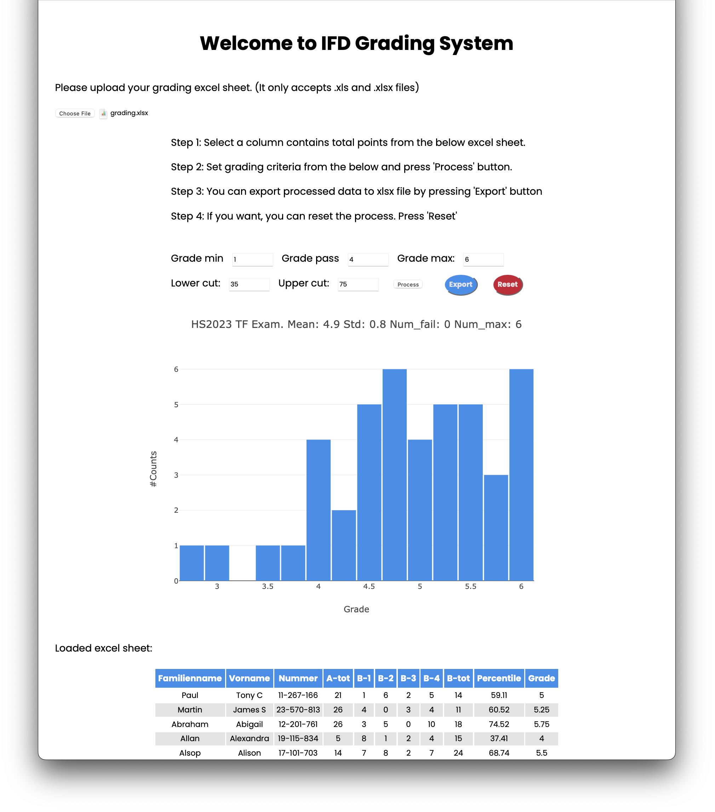

# Grading System in IFD

You can grade exam by providing an Excel sheet.

## Description

### Step-by-step guide

- Step 0: Load grading file (`.xlsx`) by clicking `Choose File` button.
- Step 1: Select a column contains total points from the below Excel sheet.
- Step 2: Set grading criteria from the below and press `Process` button.
- Step 3: You can export processed data to `.xlsx` file by pressing `Export` button.
- Step 4: Pressing `Process` button once again will reset the data.

### Required parameters

- You need to provide minimum grade, pass grade, max grade, lower cut, and upper cut.
  - Minimum grade means minimum amount of grade that student can possibly obtain.
  - Maximum grade means Maximum amount of grade that student can possibly obtain.
  - Student beyond pass grade will pass the exam.
  - Lower and upper cuts are used to defined which obtained points are used to determine pass and max grade.

### Demo

Demo using the dummy data (`./data/grading.xlsx`)

> All information in the dummy data is randomly generated.

### Contact

If you have any question, please contact: kchung@stduent.ethz.ch 